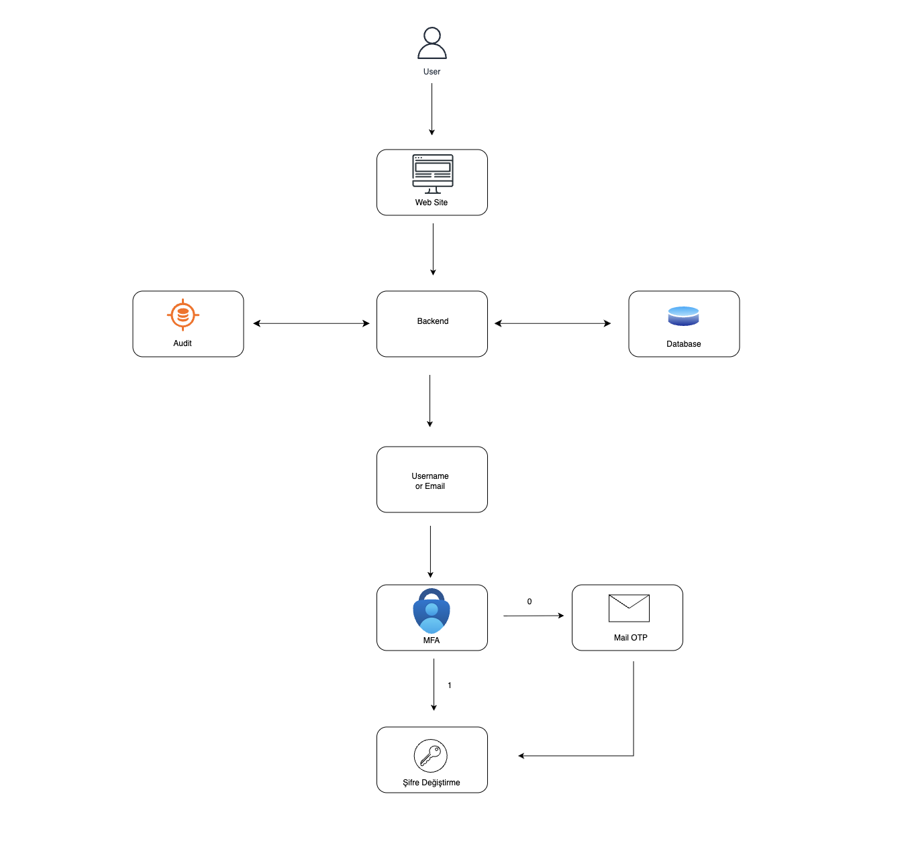

[EN]

## Project Title

IAM-Inspired Self-Service Password Reset (SSPR) Portal

## Description

A portfolio-grade self-service password reset portal inspired by IAM practices. It combines a React/Vite frontend with a Node.js/Express API and MongoDB persistence to demonstrate secure reset flows, MFA-style verification, and audit-ready event tracking.

## Features

- Email-based login initiation with enumeration-safe responses
- Push-style approval simulation with automatic email OTP fallback
- Short-lived reset tokens with JWT validation
- Audit logging for security-critical events
- Modular TypeScript backend and componentized React UI

## Architecture Diagram



## Screenshots


## Technologies Used

- React 18 + Vite + TypeScript
- Node.js + Express + TypeScript
- MongoDB + Mongoose
- JWT (jsonwebtoken)
- bcrypt
- Nodemailer
- Docker Compose (local demo)

## Installation

```bash
cd server
npm install

cd ../client
npm install
```

## Running the Project

Backend:

```bash
cd server
npm run dev
```

Frontend:

```bash
cd client
npm run dev
```

Docker (full stack):

```bash
docker compose up --build
```

Default ports:

- Frontend: http://localhost:5173
- Backend: http://localhost:4000
- MongoDB: localhost:27017

## Environment Variables

Create `server/.env` with the following:

```bash
NODE_ENV=development
PORT=4000
MONGODB_URI=mongodb://localhost:27017/sspr
JWT_RESET_SECRET=change-me
JWT_RESET_EXPIRES_IN=10m
FLOW_TIMEOUT_SECONDS=180
SMTP_HOST=
SMTP_PORT=587
SMTP_USER=
SMTP_PASS=
SMTP_FROM=no-reply@example.com
```

## Authentication Flow

- Email login: user submits email to start the reset flow.
- OTP verification: after push approval timeout, the system sends an email OTP and requires verification.
- Timeout (3 minutes): the auth flow expires after 180 seconds by default (configurable via `FLOW_TIMEOUT_SECONDS`).
- Password reset/change: once OTP is verified, the user sets a new password; the server validates and stores it hashed.
- Token safety: reset tokens are issued server-side and must not be rendered or exposed in the frontend UI.

## Security Notes

- Passwords are stored as bcrypt hashes.
- OTPs are hashed and expire after 5 minutes; resend is rate-limited.
- Reset tokens are short-lived JWTs.
- Audit logs capture security-critical events for traceability.

## Folder Structure

```text
.
├─ client
│  ├─ src
│  │  ├─ components
│  │  ├─ hooks
│  │  ├─ i18n
│  │  ├─ pages
│  │  ├─ services
│  │  ├─ styles
│  │  ├─ types
│  │  ├─ utils
│  │  ├─ App.tsx
│  │  └─ main.tsx
│  ├─ index.html
│  └─ vite.config.ts
├─ server
│  ├─ src
│  │  ├─ config
│  │  ├─ controllers
│  │  ├─ middleware
│  │  ├─ models
│  │  ├─ routes
│  │  ├─ seed
│  │  ├─ services
│  │  ├─ types
│  │  ├─ utils
│  │  ├─ validators
│  │  ├─ app.ts
│  │  └─ index.ts
│  └─ package.json
├─ docker-compose.yml
└─ README.md
```

## API Overview

- `GET /health`
- `POST /api/sspr/request`
- `GET /api/sspr/status/:resetRequestId`
- `POST /api/sspr/otp/verify`
- `POST /api/sspr/otp/resend`
- `POST /api/sspr/reset/validate`
- `POST /api/sspr/reset-password`
- `GET /api/authenticator/pending`
- `POST /api/authenticator/approve`
- `POST /api/authenticator/deny`
- `GET /api/audit-logs`

## Test Kullanıcısı

aliefe@gmail.com

[TR]

## Proje Başlığı

IAM Esinli Self-Service Password Reset (SSPR) Portalı

## Açıklama

Bu proje, IAM yaklaşımlarından ilham alan, portföy kalitesinde bir self-service şifre sıfırlama portalıdır. React/Vite arayüzü, Node.js/Express API’si ve MongoDB kalıcılığı ile güvenli sıfırlama akışlarını, MFA benzeri doğrulamayı ve denetlenebilir olay kayıtlarını gösterir.

## Özellikler

- E-posta ile giriş başlatma ve kullanıcı gizliliğini koruyan yanıtlar
- Push onay simülasyonu ve otomatik e-posta OTP yedek akışı
- Kısa ömürlü JWT reset token doğrulaması
- Güvenlik açısından kritik olaylar için audit log
- Modüler TypeScript backend ve bileşen bazlı React UI

## Mimari Şema


## Ekran Görüntüleri


## Kullanılan Teknolojiler

- React 18 + Vite + TypeScript
- Node.js + Express + TypeScript
- MongoDB + Mongoose
- JWT (jsonwebtoken)
- bcrypt
- Nodemailer
- Docker Compose (lokal demo)

## Kurulum

```bash
cd server
npm install

cd ../client
npm install
```

## Projeyi Çalıştırma

Backend:

```bash
cd server
npm run dev
```

Frontend:

```bash
cd client
npm run dev
```

Docker (tam yığın):

```bash
docker compose up --build
```

Varsayılan portlar:

- Frontend: http://localhost:5173
- Backend: http://localhost:4000
- MongoDB: localhost:27017

## Ortam Değişkenleri

`server/.env` dosyası oluşturun:

```bash
NODE_ENV=development
PORT=4000
MONGODB_URI=mongodb://localhost:27017/sspr
JWT_RESET_SECRET=change-me
JWT_RESET_EXPIRES_IN=10m
FLOW_TIMEOUT_SECONDS=180
SMTP_HOST=
SMTP_PORT=587
SMTP_USER=
SMTP_PASS=
SMTP_FROM=no-reply@example.com
```

## Kimlik Doğrulama Akışı

- E-posta girişi: kullanıcı e-posta adresi ile reset akışını başlatır.
- OTP doğrulama: push onayı zaman aşımına uğrarsa sistem e-posta OTP gönderir ve doğrulama ister.
- Zaman aşımı (3 dakika): doğrulama akışı varsayılan olarak 180 saniyede biter (`FLOW_TIMEOUT_SECONDS` ile değiştirilebilir).
- Şifre sıfırlama/değiştirme: OTP doğrulandıktan sonra kullanıcı yeni şifre belirler; sunucu doğrular ve hash’leyerek kaydeder.
- Token güvenliği: reset token’ları sunucuda üretilir ve frontend arayüzünde gösterilmemelidir.

## Güvenlik Notları

- Parolalar bcrypt ile hash’lenir.
- OTP’ler hash’lenir ve 5 dakika içinde geçerliliğini yitirir; yeniden gönderim rate-limitlidir.
- Reset token’ları kısa ömürlü JWT’lerdir.
- Audit log kayıtları güvenlik açısından kritik tüm olayları izler.

## Klasör Yapısı

```text
.
├─ client
│  ├─ src
│  │  ├─ components
│  │  ├─ hooks
│  │  ├─ i18n
│  │  ├─ pages
│  │  ├─ services
│  │  ├─ styles
│  │  ├─ types
│  │  ├─ utils
│  │  ├─ App.tsx
│  │  └─ main.tsx
│  ├─ index.html
│  └─ vite.config.ts
├─ server
│  ├─ src
│  │  ├─ config
│  │  ├─ controllers
│  │  ├─ middleware
│  │  ├─ models
│  │  ├─ routes
│  │  ├─ seed
│  │  ├─ services
│  │  ├─ types
│  │  ├─ utils
│  │  ├─ validators
│  │  ├─ app.ts
│  │  └─ index.ts
│  └─ package.json
├─ docker-compose.yml
└─ README.md
```

## API Özeti

- `GET /health`
- `POST /api/sspr/request`
- `GET /api/sspr/status/:resetRequestId`
- `POST /api/sspr/otp/verify`
- `POST /api/sspr/otp/resend`
- `POST /api/sspr/reset/validate`
- `POST /api/sspr/reset-password`
- `GET /api/authenticator/pending`
- `POST /api/authenticator/approve`
- `POST /api/authenticator/deny`
- `GET /api/audit-logs`

## Test Kullanıcısı

aliefe@gmail.com

Developed by: Aliefe
