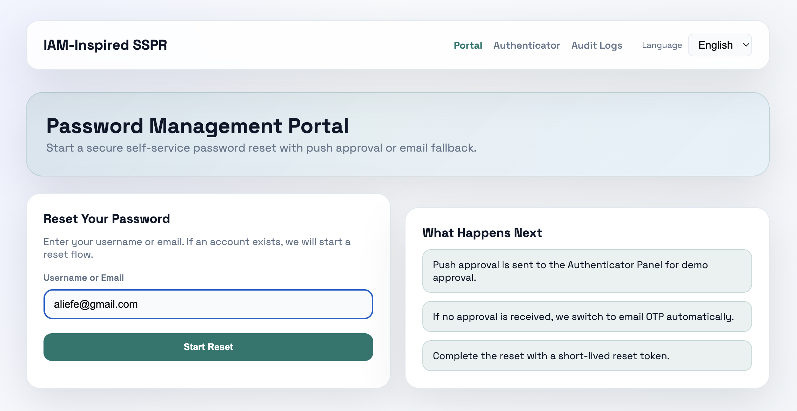
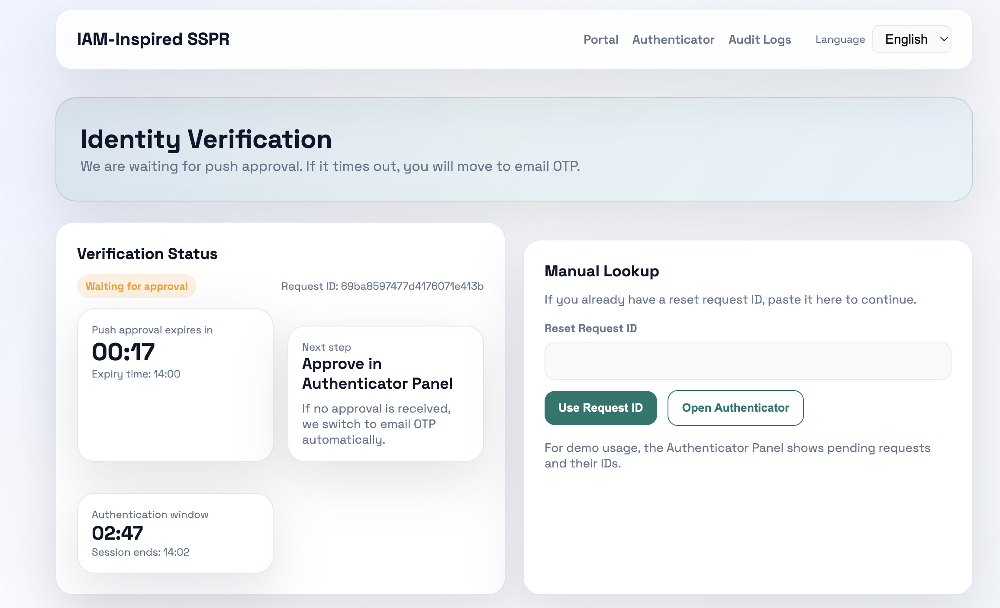
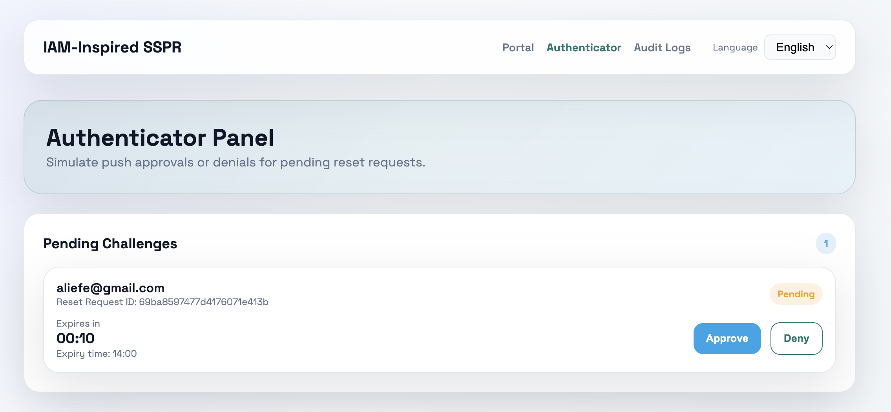
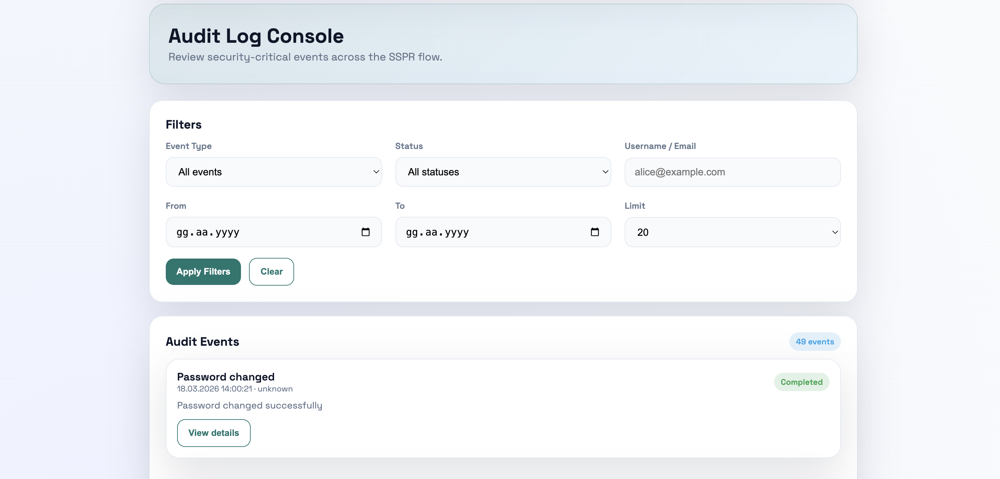

[EN]

## Project Title

IAM-Inspired Self-Service Password Reset (SSPR) Portal

## Description

A portfolio-grade self-service password reset portal inspired by IAM practices. It combines a React/Vite frontend with a Node.js/Express API and MongoDB persistence to demonstrate secure reset flows, MFA-style verification, and audit-ready event tracking.

## Features

- Email-based login initiation with enumeration-safe responses
- Push-style approval simulation with automatic email OTP fallback
- OTP verification with expiration and retry protection
- Short-lived reset tokens with JWT validation
- 3-minute flow timeout for authentication and password reset steps
- Audit logging for all security-critical events
- Secure password hashing and token handling
- Modular TypeScript backend and component-based React UI
- Multi-language support (EN/TR)

## Architecture Diagram

## Screenshots

  
  

  
  

## Technologies Used

- React 18 + Vite + TypeScript
- Node.js + Express + TypeScript
- MongoDB + Mongoose
- JWT (jsonwebtoken)
- bcrypt (password hashing)
- crypto (secure token/OTP generation)
- Nodemailer (email service)
- Docker Compose (local environment)
- i18n (multi-language support)

## Installation

cd server
npm install

cd ../client
npm install

## Running the Project

Backend:
cd server
npm run dev

Frontend:
cd client
npm run dev

Docker (full stack):
docker compose up --build

## Default Ports

- Frontend: http://localhost:5173
- Backend: http://localhost:4000
- MongoDB: localhost:27017

## Environment Variables

Create server/.env:

NODE_ENV=development
PORT=4000
MONGODB_URI=mongodb://localhost:27017/sspr
JWT_RESET_SECRET=change-me
JWT_RESET_EXPIRES_IN=10m
FLOW_TIMEOUT_SECONDS=180
SMTP_HOST=
SMTP_PORT=587
SMTP_USER=
SMTP_PASS=
SMTP_FROM=[no-reply@example.com](mailto:no-reply@example.com)

## Authentication Flow

1. Email login: user initiates reset with email
2. Push simulation: system attempts approval
3. OTP fallback: if push times out, email OTP is sent
4. OTP verification: user verifies within expiration time
5. Timeout control: flow expires after 3 minutes
6. Password reset: user sets new password
7. Token security: tokens are generated server-side and never exposed

## Security Notes

- Passwords are hashed using bcrypt
- OTPs are securely generated and hashed
- Tokens are signed using JWT and short-lived
- Sensitive data is never exposed to frontend
- Timeout prevents session abuse
- Rate limiting prevents brute-force attempts
- Audit logs track all authentication actions

## Test User

[aliefe@gmail.com](mailto:aliefe@gmail.com)

---

[TR]

## Proje Başlığı

IAM Esinli Self-Service Password Reset (SSPR) Portalı

## Açıklama

Bu proje, IAM yaklaşımlarından ilham alan, portföy kalitesinde bir self-service şifre sıfırlama portalıdır. React/Vite arayüzü, Node.js/Express API’si ve MongoDB ile güvenli akışları gösterir.

## Özellikler

- E-posta ile güvenli giriş başlatma
- Push onay simülasyonu ve OTP fallback
- Süreli OTP doğrulama
- JWT tabanlı kısa ömürlü tokenlar
- 3 dakikalık timeout
- Audit log sistemi
- Güvenli parola hashleme
- Modüler yapı
- Çoklu dil desteği (EN/TR)

## Mimari Şema

## Ekran Görüntüleri

  
  

  
  

## Kullanılan Teknolojiler

- React + Vite + TypeScript
- Node.js + Express
- MongoDB + Mongoose
- JWT
- bcrypt
- crypto
- Nodemailer
- Docker Compose
- i18n

## Kimlik Doğrulama Akışı

- Kullanıcı e-posta ile başlatır
- Push simülasyonu yapılır
- Timeout sonrası OTP gönderilir
- OTP doğrulanır
- 3 dakika içinde tamamlanmazsa iptal edilir
- Şifre değiştirme yapılır

## Güvenlik Notları

- Şifreler bcrypt ile hashlenir
- OTP ve tokenlar güvenlidir
- Token frontend’de gösterilmez
- Timeout ile güvenlik sağlanır
- Audit log ile izlenebilirlik sağlanır

## Test Kullanıcısı

[aliefe@gmail.com](mailto:aliefe@gmail.com)

---

## Developed by

Ali Efe
